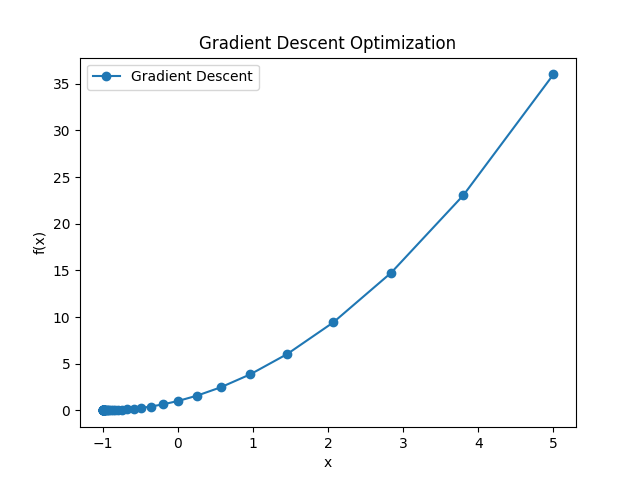
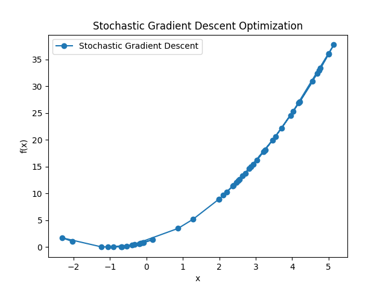
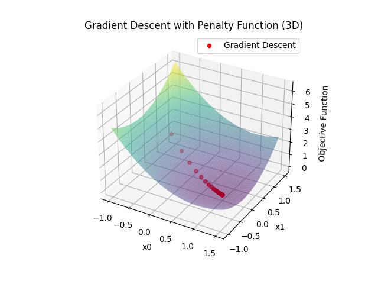

## 前言

优化问题在科学、工程和机器学习中具有广泛的应用。本次作业实现了 GDM、SDM 算法，实现了约束问题中的罚函数法和 ALM 方法，经过比较， 罚函数法实现简单，但收敛性高度依赖罚函数的选择；ALM 实现更为复杂，收敛性通常较好，且比罚函数更通用一些。

## 模型一

### 目标函数

$ f(x) = x^2 + 2x + 1 $

### 算法

#### GDM

梯度下降法通过迭代更新参数以最小化目标函数。算法如下： 

1. 初始化参数：```x = 5.0```
2. 设置学习率：```learning_rate = 0.1```
3. 设置迭代次数：```num_iterations = 50```
4. 迭代更新：```x = x - learning_rate * grad(x) ```

#### SDM

随机梯度下降法的形式如下：

1. 初始化参数：```x = 5.0```
2. 设置学习率：```learning_rate = 0.1```
3. 设置迭代次数：```num_iterations = 50```
4. 设置小批次大小：```batch_size = 5```
5. 随机选择小批次数据点：```batch_data = data_points[np.random.choice(len(data_points), batch_size, replace=False)]```
6. 计算小批次平均梯度：```avg_gradient = np.mean(gradient(batch_data))```
7. 迭代更新：```x = x - learning_rate * avg_gradient```

### 数值试验

我们使用了初始值为5.0的参数，并观察了50次迭代的优化过程，通过数值实验验证了 GDM 和 SDM 算法。





## 模型二

### 目标函数

$ f(x) = x_0^2+x_1^2-2x_0+1 $

### 约束条件

$ x_0+x_1\leq 1 $

$2x_0-3\leq x_1$

### 算法

#### 罚函数法

罚函数法的梯度下降算法如下：

1. 初始化参数：$x=(-0.5,\space 0.5)^T$
2. 设置学习率：```learing_rate = 0.1```
3. 设置迭代次数：```iterations = 50```
4. 设置罚参数：```penalty_param = 10.0```
5. 设置约束条件一：```x[0] + x[1] - 1```
6. 设置约束条件二：```2 * x[0] - x[1] - 3```
7. 计算总梯度：```total_gradient = gradient + 2 * penalty_param * np.sum([max(0, constraint(x)) * np.array(gradient) for constraint in constraints], axis=0)```
9. 迭代更新：```x = x - learning_rate * total_gradient```

#### ALM

ALM 算法如下：

1. 初始化参数：```x = 5.0```
2. 设置学习率：```learing_rate = 0.1```
3. 设置迭代次数：```num_iterations = 50```
4. 设置罚项系数：```penalty_coefficient = 10```
5. 设置约束条件的值：```constraint_value = 2```
6. 计算 ALM 的目标函数：```objective_function = f(x) + sum_of_lagrangian_terms + (penalty_coefficient / 2) * sum_of_penalties```
7. 计算总目标梯度：```gradient_total_penalty = gradient_of_f(x) + gradient_of_lagrangian_terms + penalty_coefficient * gradient_of_penalties```
8. 迭代更新：```x = x - learning_rate * gradient_total_penalty```

### 数值实验

我们通过数值实验验证了罚函数法梯度下降算法的性能。我们使用了初始值为5.0的参数，并观察了50次迭代的优化过程。



实验结果表明，在约束条件下，算法能够有效地优化目标函数，并且罚项系数的选择对优化结果产生了影响。图表展示了优化过程中目标函数值的变化。

通过实验，我们得出结论：罚函数法梯度下降算法适用于处理约束优化问题，并且在合适的罚项系数下，能够取得令人满意的优化结果。