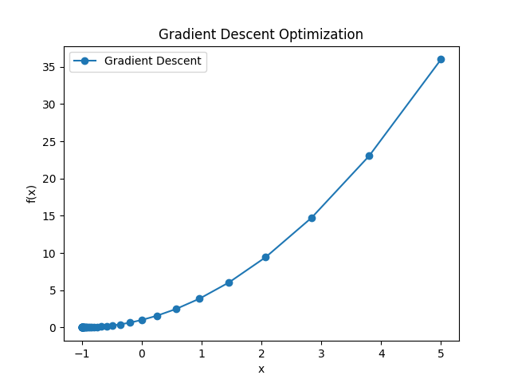
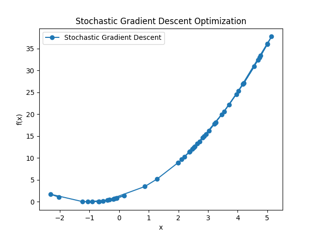
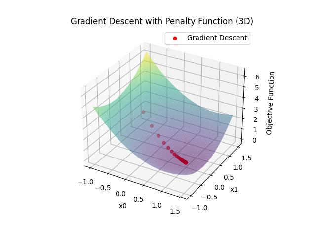

# 机器学习中的优化算法作业 - 2 

姓名：谢泽钰

学号：2020012544

## 前言

优化问题在科学、工程和机器学习中具有广泛的应用。本次作业实现了 GDM、SDM 算法，实现了约束问题中的罚函数法和 ALM 方法，经过比较， 罚函数法实现简单，但收敛性高度依赖罚函数的选择；ALM 实现更为复杂，收敛性通常较好，且比罚函数更通用一些。

## 模型一

### 目标函数

$ f(x) = x^2 + 2x + 1 $

### 算法

#### GDM

梯度下降法通过迭代更新参数以最小化目标函数。算法如下： 

1. 初始化参数：```x = 5.0```
2. 设置学习率：```learning_rate = 0.1```
3. 设置迭代次数：```num_iterations = 50```
4. 迭代更新：```x = x - learning_rate * grad(x) ```

#### SDM

随机梯度下降法的形式如下：

1. 初始化参数：```x = 5.0```
2. 设置学习率：```learning_rate = 0.1```
3. 设置迭代次数：```num_iterations = 50```
4. 设置小批次大小：```batch_size = 5```
5. 随机选择小批次数据点：```batch_data = data_points[np.random.choice(len(data_points), batch_size, replace=False)]```
6. 计算小批次平均梯度：```avg_gradient = np.mean(gradient(batch_data))```
7. 迭代更新：```x = x - learning_rate * avg_gradient```

### 数值试验

我们使用了初始值为5.0的参数，并观察了50次迭代的优化过程，通过数值实验验证了 GDM 和 SDM 算法。





## 模型二

### 目标函数

$ f(x) = x_0^2+x_1^2-2x_0+1 $

### 约束条件

$ x_0+x_1\leq 1 $

$2x_0-3\leq x_1$

### 算法

#### 罚函数法

罚函数法的梯度下降算法如下：

1. 初始化参数：$x=(-0.5,\space 0.5)^T$
2. 设置学习率：```learing_rate = 0.1```
3. 设置迭代次数：```iterations = 50```
4. 设置罚参数：```penalty_param = 10.0```
5. 设置约束条件一：```x[0] + x[1] - 1```
6. 设置约束条件二：```2 * x[0] - x[1] - 3```
7. 计算总梯度：```total_gradient = gradient + 2 * penalty_param * np.sum([max(0, constraint(x)) * np.array(gradient) for constraint in constraints], axis=0)```
9. 迭代更新：```x = x - learning_rate * total_gradient```

#### ALM

ALM 算法如下：

1. 初始化参数：$x=(0.0,\space 0.0)^T$
2. 设置容错率：```tolerance = 1e-6```
3. 设置最大迭代次数：```max_iterations = 1000```
4. 设置罚项：$\rho = 1.0$
5. 设置约束条件一：```x[0] + x[1] - 1```
6. 设置约束条件二：```2 * x[0] - x[1] - 3```
7. 迭代更新：```result = minimize(lambda x: augmented_lagrangian(x, lambda1, lambda2, rho), x, method='BFGS')```

### 数值实验

我们通过数值实验验证了罚函数法梯度下降算法的性能。我们使用了初始值为5.0的参数，并观察了50次迭代的优化过程。



实验结果表明，在约束条件下，算法能够有效地优化目标函数，并且罚项系数的选择对优化结果产生了影响。图表展示了优化过程中目标函数值的变化。

ALM 的迭代次数并不固定，因而图像不具有普适性。

通过实验，我们证实结论：罚函数法梯度下降算法适用于处理约束优化问题，并且在合适的罚项系数下，能够取得令人满意的优化结果。ALM 较为复杂，且不需要过多考虑罚项系数。

## 代码实现

### GDM

```
import numpy as np
import matplotlib.pyplot as plt

def target_function(x):
    return x**2 + 2*x + 1

def gradient(x):
    return 2*x + 2

def gradient_descent(initial_x, learning_rate, num_iterations):
    x_values = []
    y_values = []

    x = initial_x
    for _ in range(num_iterations):
        x_values.append(x)
        y_values.append(target_function(x))

        x = x - learning_rate * gradient(x)

    return x_values, y_values

def plot_gradient_descent(x_values, y_values):
    plt.plot(x_values, y_values, '-o', label='Gradient Descent')
    plt.xlabel('x')
    plt.ylabel('f(x)')
    plt.title('Gradient Descent Optimization')
    plt.legend()
    plt.show()

if __name__ == "__main__":
    initial_x = 5.0  # 初始值
    learning_rate = 0.1  # 学习率
    num_iterations = 50  # 迭代次数

    x_values, y_values = gradient_descent(
        initial_x, learning_rate, num_iterations)
    plot_gradient_descent(x_values, y_values)
```

### SDM

```
import numpy as np
import matplotlib.pyplot as plt

def target_function(x):
    return x**2 + 2*x + 1

def gradient(x):
    return 2*x + 2

def stochastic_gradient_descent(initial_x, learning_rate, num_iterations, batch_size):
    x_values = []
    y_values = []

    x = initial_x
    data_points = np.linspace(-10, 10, 100)  # 生成一些数据点用于随机选择

    for _ in range(num_iterations):
        x_values.append(x)
        y_values.append(target_function(x))

        # 随机选择小批次数据点
        batch_indices = np.random.choice(len(data_points), batch_size, replace=False)
        batch_data = data_points[batch_indices]

        # 计算小批次的平均梯度
        avg_gradient = np.mean(gradient(batch_data))

        # 更新x值
        x = x - learning_rate * avg_gradient

    return x_values, y_values

def plot_stochastic_gradient_descent(x_values, y_values):
    plt.plot(x_values, y_values, '-o', label='Stochastic Gradient Descent')
    plt.xlabel('x')
    plt.ylabel('f(x)')
    plt.title('Stochastic Gradient Descent Optimization')
    plt.legend()
    plt.show()

if __name__ == "__main__":
    initial_x = 5.0  # 初始值
    learning_rate = 0.1  # 学习率
    num_iterations = 50  # 迭代次数
    batch_size = 5  # 小批次大小

    x_values, y_values = stochastic_gradient_descent(initial_x, learning_rate, num_iterations, batch_size)
    plot_stochastic_gradient_descent(x_values, y_values)
```

### 罚函数法

```
import numpy as np
import matplotlib.pyplot as plt
from scipy.optimize import approx_fprime

def objective_function(x):
    return x[0]**2 + x[1]**2 - 2*x[0] + 1

def constraint1(x):
    return x[0] + x[1] - 1

def constraint2(x):
    return 2*x[0] - x[1] - 3

def penalty_function(x, constraints, penalty_param):
    penalty = 0
    for constraint in constraints:
        penalty += max(0, constraint(x))**2
    return penalty_param * penalty

def gradient_descent(initial_x, learning_rate, iterations, penalty_param):
    x = np.array(initial_x, dtype=float)
    history = [x.copy()]

    for _ in range(iterations):
        gradient = approx_fprime(x, objective_function, epsilon=1e-8)

        constraint_gradients = []
        for constraint in constraints:
            constraint_gradients.append(
                approx_fprime(x, constraint, epsilon=1e-8))

        total_gradient = gradient + 2 * penalty_param * \
            np.sum([max(0, constraint(x)) * np.array(gradient)
                   for constraint in constraints], axis=0)
        x = x - learning_rate * total_gradient

        history.append(x.copy())

    return np.array(history)

initial_point = [-0.5, 0.5]
learning_rate = 0.1
iterations = 50
penalty_param = 10.0

constraints = [constraint1, constraint2]

history = gradient_descent(
    initial_point, learning_rate, iterations, penalty_param)

# 绘图
fig = plt.figure()
ax = fig.add_subplot(111, projection='3d')

x_vals = np.linspace(-1, 1.5, 100)
y_vals = np.linspace(-1, 1.5, 100)
X, Y = np.meshgrid(x_vals, y_vals)
Z = X**2 + Y**2 - 2*X + 1

ax.plot_surface(X, Y, Z, alpha=0.5, cmap='viridis')
ax.scatter(history[:, 0], history[:, 1], objective_function(
    history.T), c='red', marker='o', label='Gradient Descent')
ax.set_title('Gradient Descent with Penalty Function (3D)')
ax.set_xlabel('x0')
ax.set_ylabel('x1')
ax.set_zlabel('Objective Function')
ax.legend()

plt.show()
```

### ALM

```
import numpy as np
from scipy.optimize import minimize

def objective_function(x):
    return x[0]**2 + x[1]**2 - 2*x[0] + 1

def constraint1(x):
    return x[0] + x[1] - 1

def constraint2(x):
    return 2*x[0] - x[1] - 3

def lagrangian(x, lambda1, lambda2):
    return objective_function(x) + lambda1 * constraint1(x) + lambda2 * constraint2(x)

def augmented_lagrangian(x, lambda1, lambda2, rho):
    return lagrangian(x, lambda1, lambda2) + (rho/2) * (max(0, constraint1(x))**2 + max(0, constraint2(x))**2)

def alm_gradient_descent(initial_x, rho, max_iterations=1000, tolerance=1e-6):
    x = initial_x
    lambda1 = 0.0
    lambda2 = 0.0

    for iteration in range(max_iterations):
        result = minimize(lambda x: augmented_lagrangian(x, lambda1, lambda2, rho), x, method='BFGS')

        x = result.x
        lambda1 = max(0, lambda1 + rho * constraint1(x))
        lambda2 = max(0, lambda2 + rho * constraint2(x))

        if np.linalg.norm(result.jac) < tolerance:
            break

    return x

initial_guess = np.array([0.0, 0.0])
rho = 1.0
result = alm_gradient_descent(initial_guess, rho)

print("Optimal solution:", result)
print("Objective value at optimal solution:", objective_function(result))
print("Constraint 1 value at optimal solution:", constraint1(result))
print("Constraint 2 value at optimal solution:", constraint2(result))
```

