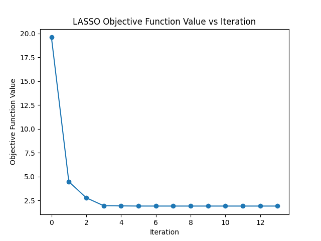
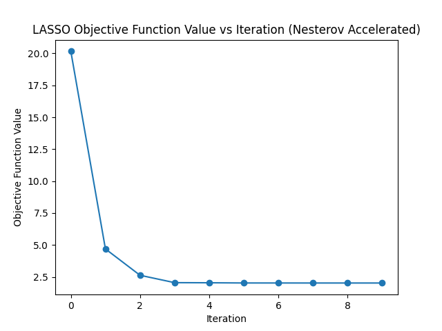
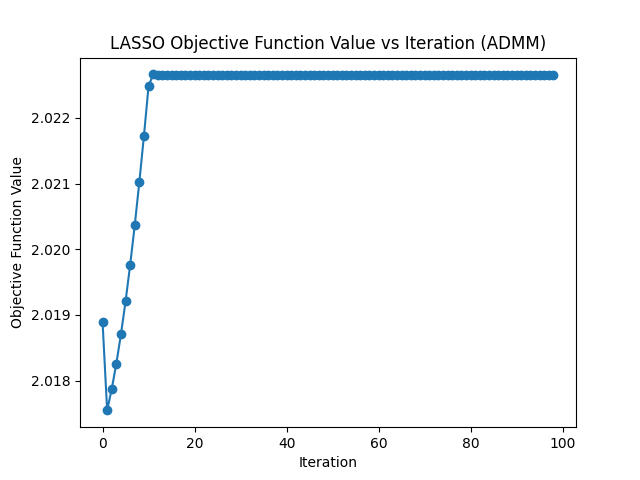

# 机器学习中的优化算法作业 - 4

（8.16 题见上文手写部分）

姓名：谢泽钰

学号：2020012544

## LASSO 问题描述

LASSO 是一种用于线性回归和统计建模的正则化方法。

它通过在损失函数中添加一个 $L_1$ 正则项，强制使一些模型参数变为零，从而实现特征选择和模型稀疏性。

LASSO问题可以通过以下优化问题来描述：

$min\{\frac{1}{2n}\sum_{i=1}^{n}(y_i-\beta_0-\sum_{j=1}^{p}x_{ij}\beta_j)^2+\lambda\sum_{j=1}^p|\beta_j|$

其中：

- $n$ 是样本数量。
- $p$ 是特征的数量。
- $y_i$ 是观测值。
- $x_{ij}$ 是第 $i$ 个样本的第 $j$ 个特征的值。
- $\beta_0$ 是截距项。
- $\beta_j$ 是第 $j$ 个特征的系数。
- $\lambda$ 是控制正则化程度的超参数。

## 近似点梯度算法

### 代码实现

```
import numpy as np
from scipy.optimize import minimize
import matplotlib.pyplot as plt

# 生成模拟数据
np.random.seed(42)
n = 100
p = 20

X = np.random.randn(n, p)
true_beta = np.random.randn(p)
noise = 0.1 * np.random.randn(n)
y = np.dot(X, true_beta) + noise

# 定义 LASSO 目标函数
def lasso_objective(beta, X, y, lambda_):
    n = len(y)
    residuals = y - np.dot(X, beta)
    lasso_term = lambda_ * np.sum(np.abs(beta))
    objective = 0.5 * np.sum(residuals**2) + lasso_term
    return objective

def lasso_gradient(beta, X, y, lambda_):
    n = len(y)
    residuals = y - np.dot(X, beta)
    sign = np.sign(beta)
    gradient = -np.dot(X.T, residuals) + lambda_ * sign
    return gradient

# 记录
def callback_function(beta):
    obj_value = lasso_objective(beta, X, y, lambda_)
    objective_values.append(obj_value)

# 运行
initial_beta = np.zeros(p)
lambda_ = 0.1
objective_values = []

result = minimize(
    fun=lasso_objective,
    x0=initial_beta,
    args=(X, y, lambda_),
    jac=lasso_gradient,
    method='L-BFGS-B',
    callback=callback_function
)

print(objective_values)

# 绘制
plt.plot(objective_values[1:], marker='o')
plt.title('LASSO Objective Function Value vs Iteration')
plt.xlabel('Iteration')
plt.ylabel('Objective Function Value')
plt.show()

```

### 输出结果



## Nesterov 加速算法

### 代码实现

```
import numpy as np
from scipy.optimize import minimize
import matplotlib.pyplot as plt

# 生成模拟数据
np.random.seed(42)
n = 100
p = 20

X = np.random.randn(n, p)
true_beta = np.random.randn(p)
noise = 0.1 * np.random.randn(n)
y = np.dot(X, true_beta) + noise

# 定义 LASSO 目标函数
def lasso_objective(beta, X, y, lambda_):
    n = len(y)
    residuals = y - np.dot(X, beta)
    lasso_term = lambda_ * np.sum(np.abs(beta))
    objective = 0.5 * np.sum(residuals**2) + lasso_term
    return objective

def lasso_gradient(beta, X, y, lambda_):
    n = len(y)
    residuals = y - np.dot(X, beta)
    sign = np.sign(beta)
    gradient = -np.dot(X.T, residuals) + lambda_ * sign
    return gradient

# 记录
def callback_function(beta):
    obj_value = lasso_objective(beta, X, y, lambda_)
    objective_values.append(obj_value)

# 运行
initial_beta = np.zeros(p)
lambda_ = 0.1
objective_values = []

def nesterov_gradient(beta, X, y, lambda_, momentum):
    n = len(y)
    residuals = y - np.dot(X, beta)
    sign = np.sign(beta)
    gradient = -np.dot(X.T, residuals) + lambda_ * sign
    return gradient + momentum * (beta - old_beta)

old_beta = initial_beta.copy()
momentum = 0.9  # 设置动量参数

result = minimize(
    fun=lasso_objective,
    x0=initial_beta,
    args=(X, y, lambda_),
    jac=lambda beta, X, y, lambda_: nesterov_gradient(beta, X, y, lambda_, momentum),
    method='L-BFGS-B',
    callback=callback_function
)

print(objective_values)

# 绘制
plt.plot(objective_values[1:], marker='o')
plt.title('LASSO Objective Function Value vs Iteration (Nesterov Accelerated)')
plt.xlabel('Iteration')
plt.ylabel('Objective Function Value')
plt.show()
```

### 输出结果



## 交替方向乘子法

### 代码实现

```
import numpy as np
import matplotlib.pyplot as plt

# 生成模拟数据
np.random.seed(42)
n = 100
p = 20

X = np.random.randn(n, p)
true_beta = np.random.randn(p)
noise = 0.1 * np.random.randn(n)
y = np.dot(X, true_beta) + noise

# 定义 LASSO 目标函数
def lasso_objective(beta, X, y, lambda_, rho, z):
    n = len(y)
    residuals = y - np.dot(X, beta)
    lasso_term = lambda_ * np.sum(np.abs(z))
    augmented_term = (rho / 2) * np.sum((beta - z + u)**2)
    objective = 0.5 * np.sum(residuals**2) + lasso_term + augmented_term
    return objective

# 初始化参数
beta = np.zeros(p)
z = np.zeros(p)
u = np.zeros(p)
rho = 1.0  # 步长

# ADMM 迭代
max_iterations = 100
lambda_ = 0.1
objective_values = []

for iteration in range(max_iterations):
    # 求解 beta
    beta = np.linalg.solve(np.dot(X.T, X) + rho * np.identity(p), np.dot(X.T, y) + rho * (z - u))

    # 求解 z（软阈值运算）
    z = np.maximum(0, beta + u - lambda_ / rho) - np.maximum(0, -beta - u - lambda_ / rho)

    # 更新 u
    u = u + beta - z

    # 计算目标函数值
    obj_value = lasso_objective(beta, X, y, lambda_, rho, z)
    objective_values.append(obj_value)

# 打印
print("Optimal beta:", beta)
print("Objective values:", objective_values)

# 绘制
plt.plot(objective_values[1:], marker='o')
plt.title('LASSO Objective Function Value vs Iteration (ADMM)')
plt.xlabel('Iteration')
plt.ylabel('Objective Function Value')
plt.show()
```

### 输出结果


